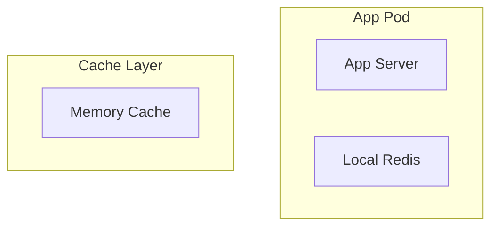
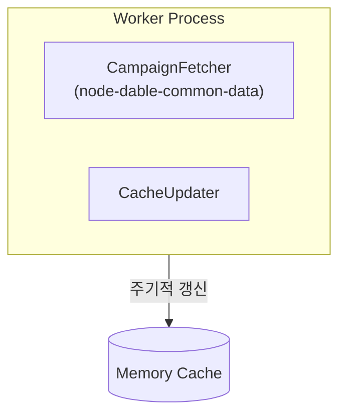
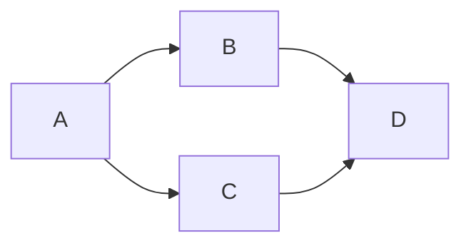
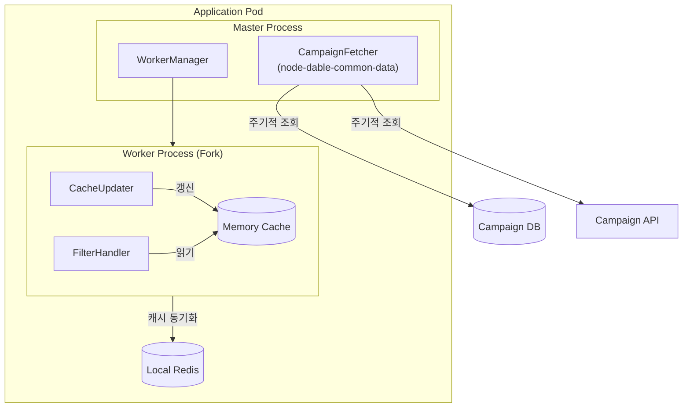

# Mermaid Architecture Diagram

## Overview

시스템 아키텍처와 처리 흐름을 Mermaid 다이어그램으로 표현한다.
이터레이션을 줄이기 위해 컨벤션을 사전에 확인하고 초안을 작성한다.

## 다이어그램 유형 선택

| 요청                        | Mermaid 유형               |
| --------------------------- | -------------------------- |
| 서버 구성, 컴포넌트 관계    | `graph TD` 또는 `graph LR` |
| API 처리 흐름, 요청/응답    | `sequenceDiagram`          |
| 데이터 흐름, 파이프라인     | `flowchart TD`             |
| 배포 인프라 (Pod, 컨테이너) | `graph TD` + subgraph      |

## 컨벤션 (세션 이력 기반)

### 그룹핑 (subgraph)



- **Pod/Container 경계**: `subgraph`로 명시
- **레이어 구분**: Cache Layer, Worker Process 등 박스로 명시
- **외부 시스템**: Pod 밖에 별도 노드로 표현

### 워커/프로세스



- 동일한 Fork로 실행되는 워커는 박스 1개로 표현
- 외부 모듈 참조는 `(모듈명)` 형식으로 표시
- 화살표에 레이블로 데이터 흐름 방향 명시

### 화살표 정리 원칙



- 화살표가 교차하지 않도록 레이아웃 우선 설계
- 복잡하면 `LR` (좌→우)로 방향 변경
- 단방향 데이터 흐름은 위→아래 (`TD`)

## 작성 프로세스

### 1단계: 코드베이스 탐색

```bash
# 서버 진입점 확인
ls src/ && cat package.json | grep -E "main|start"

# 주요 컴포넌트 파악
grep -rn "class\|export" src/ --include="*.ts" | head -30
```

### 2단계: 초안 작성 전 구조 요약 공유

```
확인한 구조:
- Master: CampaignFetcher, WorkerManager
- Worker(Fork): CacheUpdater, FilterHandler
- 캐시: Memory(워커 내부), Redis(별도 컨테이너)
- 외부: DB, Campaign API

이 구조로 다이어그램 작성하겠습니다.
```

### 3단계: 다이어그램 작성



### 4단계: 피드백 반영

피드백 유형별 처리:

| 피드백                   | 처리 방법                                  |
| ------------------------ | ------------------------------------------ |
| "박스를 안에 넣어주세요" | `subgraph` 중첩                            |
| "화살표가 너무 복잡해요" | `LR` 레이아웃 변경 또는 불필요 화살표 제거 |
| "레이어를 분리해주세요"  | 새 `subgraph` 추가                         |
| "모듈명 추가해주세요"    | 노드 레이블에 `\n(모듈명)` 추가            |

## Common Mistakes

| 실수                               | 교정                            |
| ---------------------------------- | ------------------------------- |
| 같은 종류 워커를 여러 박스로 표현  | Fork된 동일 워커는 박스 1개     |
| Local Redis를 외부 시스템으로 표현 | App Pod 내부 subgraph에 포함    |
| Memory Cache를 Worker 밖에 표현    | Worker Process 안에 포함        |
| 화살표 없이 박스만 나열            | 데이터/제어 흐름 방향 필수 표시 |
| 초안 없이 바로 복잡한 다이어그램   | 구조 요약 공유 후 작성          |
