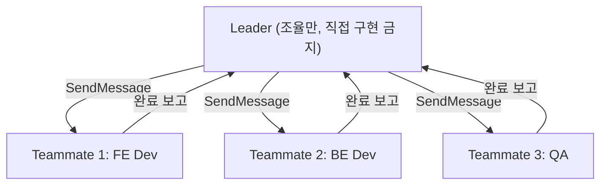
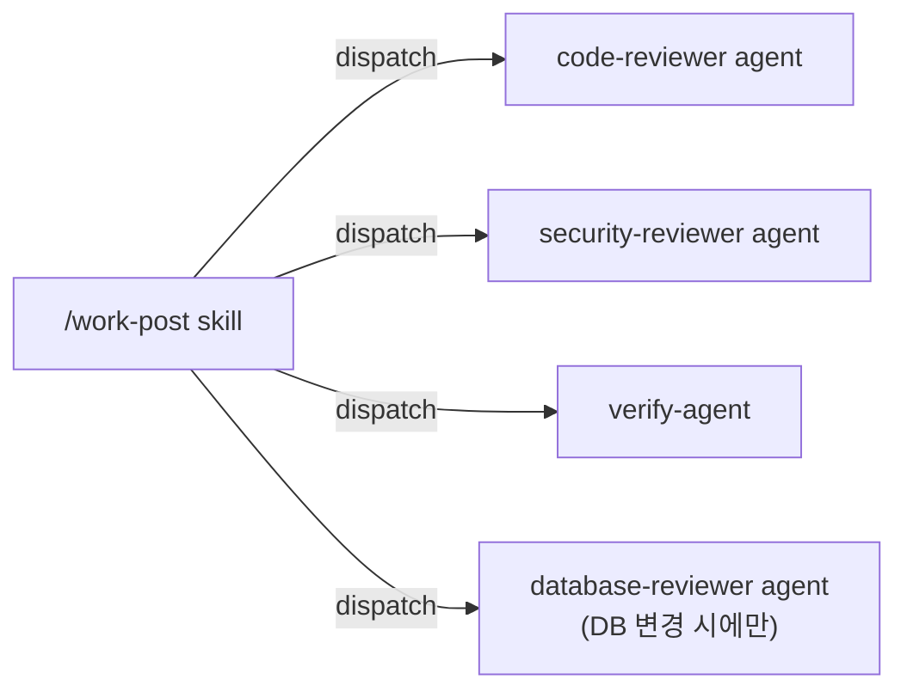
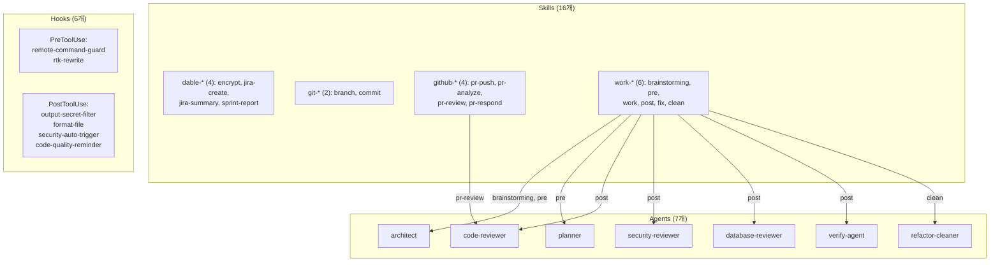
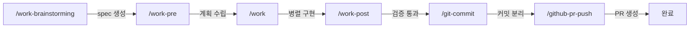
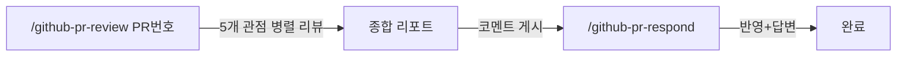

# Claude Code 커스터마이징 가이드

> 개인 `.claude/` 설정을 공유하고, 팀 공통으로 적용할 Agents/Skills를 제안합니다.

## 목차

1. [개요](#1-개요)
2. [설정 구조 가이드](#2-설정-구조-가이드)
3. [내 설정 소개](#3-내-설정-소개)
4. [팀 적용 제안](#4-팀-적용-제안)
5. [개인 워크플로우](#5-개인-워크플로우)

---

## 1. 개요

### 이 문서의 목적

Claude Code는 `~/.claude/` 디렉토리를 통해 행동 규칙, sub-agent, workflow, 자동화 스크립트를 커스터마이징할 수 있습니다. 이 문서는 두 가지 목적으로 작성되었습니다:

- **[가이드]** settings.json, Agents, Skills, Hooks의 개념과 설정 방법을 설명합니다 (섹션 1-3)
- **[제안]** 팀 공통으로 적용하면 좋을 Agents/Skills를 제안합니다 (섹션 4)
- **[참고]** 개인 워크플로우를 공유합니다 (섹션 5)

### 대상 독자

- CLAUDE.md와 settings.json을 직접 설정해 본 경험이 있는 사용자
- 기본 개념보다 **실전 활용 패턴**에 관심이 있는 분

---

## 2. 설정 구조 가이드

### 2.1 기반: .claude/ 디렉토리 구조 + settings.json

#### 디렉토리 구조

```
.claude/
├── CLAUDE.md          # 행동 규칙 + 프로젝트 지침
├── settings.json      # 핵심 설정 파일 (permissions, hooks, plugins)
├── agents/            # Sub-agent 정의 (.md)
│   ├── code-reviewer.md
│   ├── architect.md
│   └── ...
├── skills/            # Workflow 레시피 (SKILL.md)
│   ├── git-commit/SKILL.md
│   ├── work-post/SKILL.md
│   └── ...
├── hooks/             # 자동 실행 스크립트 (.sh)
│   ├── remote-command-guard.sh
│   ├── format-file.sh
│   └── ...
└── rules/             # 코딩 컨벤션 (.md)
    ├── code-principles.md
    ├── typescript.md
    └── ...
```

#### settings.json 주요 필드

```json
{
  "permissions": {
    "allow": ["Bash(*)", "Read(*)", "Write(*)", "Agent(*)", "..."],
    "deny": ["Bash(*rm -rf*)", "Read(**/.env)", "..."]
  },
  "hooks": {
    "PreToolUse": [
      { "matcher": "Bash", "hooks": [{ "type": "command", "command": "..." }] }
    ],
    "PostToolUse": [
      {
        "matcher": "Edit|Write",
        "hooks": [{ "type": "command", "command": "..." }]
      }
    ]
  },
  "env": {
    "CLAUDE_CODE_EXPERIMENTAL_AGENT_TEAMS": "1"
  },
  "enabledPlugins": {
    "superpowers@claude-plugins-official": true,
    "serena@claude-plugins-official": true
  }
}
```

| 필드                | 역할                                          |
| ------------------- | --------------------------------------------- |
| `permissions.allow` | 자동 허용할 tool 패턴 (와일드카드 지원)       |
| `permissions.deny`  | 절대 실행하지 않을 tool 패턴 (allow보다 우선) |
| `hooks`             | tool 실행 전후 자동 실행 스크립트             |
| `env`               | Claude Code 환경변수                          |
| `enabledPlugins`    | 활성화할 plugin 목록                          |

#### 글로벌 vs 프로젝트 설정

| 위치                 | 범위                   | 우선순위        |
| -------------------- | ---------------------- | --------------- |
| `~/.claude/`         | 모든 프로젝트에 적용   | 낮음            |
| `<project>/.claude/` | 해당 프로젝트에만 적용 | 높음 (override) |

- `settings.json`: 프로젝트 설정이 글로벌을 **override**
- `CLAUDE.md`: 글로벌 + 프로젝트 내용이 **병합**됨
- `agents/`, `skills/`: 프로젝트에 같은 이름이 있으면 프로젝트 것을 사용

---

### 2.2 실행 체계

#### Agents

**Agent란?** 특정 역할에 특화된 sub-agent입니다. 전용 tools, model, 프롬프트를 지정하여 특정 작업에 집중하게 합니다.

**작성법:** `.claude/agents/<name>.md` 파일에 frontmatter로 설정을 정의합니다.

```yaml
---
name: code-reviewer
description: 코드 리뷰 전문. 품질, 보안, 유지보수성을 체계적으로 검토.
tools: ["Read", "Grep", "Glob", "Bash"]
model: opus
---
# Agent 프롬프트
You are Code Reviewer. Your mission is to ensure code quality...
```

| frontmatter 필드 | 역할                                               |
| ---------------- | -------------------------------------------------- |
| `name`           | agent 식별자                                       |
| `description`    | 역할 설명 (모델이 어떤 agent를 쓸지 판단하는 기준) |
| `tools`          | 사용 가능한 tool 목록 (제한하여 안전성 확보)       |
| `model`          | 사용할 모델 (`opus`, `sonnet`, `haiku`)            |

**호출 방식:** `Agent` tool의 `subagent_type` 파라미터로 호출하거나, Skill에서 자동 dispatch합니다.

---

#### Agent Teams

Agent Teams는 Leader 1명 + Teammate 최대 3명으로 구성되어 **병렬 구현**을 수행합니다.

**전제조건:**

```json
{
  "env": {
    "CLAUDE_CODE_EXPERIMENTAL_AGENT_TEAMS": "1"
  }
}
```

**구조:**



**핵심 원칙 — 파일 소유권 분리:**

같은 파일을 2명이 동시에 편집하면 덮어쓰기가 발생합니다. 반드시 팀원별로 파일 소유권을 분리해야 합니다.

```
파일 소유권 결정 로직:
1. 변경 예상 파일 목록 생성
2. 파일별 모듈/도메인 분류
3. 도메인 단위로 팀원 배정
4. 공유 파일(types, config)은 한 팀원에게 독점 배정
```

각 팀원에게 5-6개 task를 배정하며, task 간 의존성은 `addBlockedBy`로 관리합니다.

**역할 템플릿:**

| 시나리오         | 역할 구성                                             |
| ---------------- | ----------------------------------------------------- |
| 풀스택 기능 구현 | Frontend Dev + Backend Dev + QA Engineer              |
| 리팩토링         | Analyzer + Implementer + Verifier                     |
| 버그 조사        | Investigator 1 (코드) + Investigator 2 (로그) + Fixer |

---

#### Skills

**Skill이란?** 재사용 가능한 workflow 레시피입니다. 여러 단계의 작업을 하나의 명령으로 실행하며, 필요에 따라 Agent를 dispatch합니다.

**작성법:** `.claude/skills/<name>/SKILL.md` 파일에 frontmatter로 설정을 정의합니다.

```yaml
---
name: git-commit
model: sonnet
allowed-tools: Bash(git add:*), Bash(git status:*), Bash(git diff:*), Bash(git commit:*)
description: 프로젝트 컨벤션에 맞춰 git commit 생성. 관심사별 분리, staged diff 리뷰 포함.
---

## Context
- Current git status: !`git status`
- Recent commits: !`git log --oneline -10`

## Your Task
(워크플로우 정의)
```

| frontmatter 필드           | 역할                                |
| -------------------------- | ----------------------------------- |
| `name`                     | skill 식별자                        |
| `model`                    | 사용할 모델                         |
| `allowed-tools`            | 사용 가능한 tool (세밀한 패턴 지원) |
| `description`              | 역할 설명 + 트리거 조건             |
| `disable-model-invocation` | `true`이면 명시적 호출만 가능       |
| `argument-hint`            | 사용자에게 보여줄 인자 힌트         |

**두 가지 호출 방식:**

| 방식         | 설명                                 | 설정                                           |
| ------------ | ------------------------------------ | ---------------------------------------------- |
| auto-trigger | 모델이 맥락에 따라 자동 호출         | `disable-model-invocation` 미설정 또는 `false` |
| 명시적 호출  | `/skill-name` 슬래시 커맨드로만 호출 | `disable-model-invocation: true`               |

**언제 어떤 방식을 쓰나?**

- **auto-trigger**: 커밋, 리뷰 등 자주 쓰이고 맥락에 따라 자동 실행이 유용한 경우
- **명시적 호출**: JIRA 이슈 생성 등 사용자의 의도가 명확해야 하는 경우

---

#### Skill ↔ Agent 관계

**역할 구분:**

- **Skill** = 오케스트레이터 (무엇을, 어떤 순서로)
- **Agent** = 전문 실행자 (특정 역할에 집중)

Agent는 독립적으로도 호출 가능하고, 여러 Skill에서 재사용됩니다.

**예시: `/work-post` skill의 병렬 Agent dispatch**



`/work-post`는 구현 완료 후 4개 agent를 **병렬로** 호출하여 코드 품질, 보안, 빌드/테스트, DB를 동시에 검증합니다.

**Agent 재사용 예시:**

| Agent             | 호출하는 Skill                     |
| ----------------- | ---------------------------------- |
| architect         | `/work-brainstorming`, `/work-pre` |
| planner           | `/work-pre`                        |
| code-reviewer     | `/work-post`, `/github-pr-review`  |
| security-reviewer | `/work-post`                       |
| database-reviewer | `/work-post` (DB 변경 시)          |
| refactor-cleaner  | `/work-clean`                      |
| verify-agent      | `/work-post`, `/work-fix`          |

---

### 2.3 자동화 장치: Hooks

**Hook이란?** Claude가 tool을 사용할 때 전후로 자동 실행되는 shell script입니다. 위험한 명령 차단, 파일 포맷팅, 시크릿 마스킹 등을 자동화합니다.

**종류:**

| 종류        | 시점             | 가능한 동작             | 예시                           |
| ----------- | ---------------- | ----------------------- | ------------------------------ |
| PreToolUse  | tool 실행 **전** | 차단(exit 2), 입력 수정 | 위험 명령 차단, 명령어 rewrite |
| PostToolUse | tool 실행 **후** | 출력 처리, 알림, 후처리 | 파일 포맷팅, 시크릿 마스킹     |

**settings.json 설정 예시:**

```json
"hooks": {
  "PreToolUse": [
    {
      "matcher": "Bash",
      "hooks": [
        {
          "type": "command",
          "command": "~/.claude/hooks/remote-command-guard.sh",
          "timeout": 5000
        }
      ]
    }
  ],
  "PostToolUse": [
    {
      "matcher": "Edit|Write",
      "hooks": [
        {
          "type": "command",
          "command": "~/.claude/hooks/format-file.sh"
        }
      ]
    }
  ]
}
```

**핵심 개념:**

| 항목      | 설명                                                       |
| --------- | ---------------------------------------------------------- |
| `matcher` | hook이 실행될 tool 이름 패턴. `"Bash"`, `"Edit\|Write"` 등 |
| `type`    | 현재 `"command"`만 지원                                    |
| `command` | 실행할 shell script 경로                                   |
| `timeout` | 최대 실행 시간 (ms)                                        |
| exit code | `0` = 허용, `2` = 차단                                     |

**hook script 작성 요령:**

1. stdin으로 JSON 입력을 받음 (`tool_input` 필드에 실행할 명령/파일 경로 포함)
2. 검사 로직 수행
3. exit code로 결과 전달 (0 = 통과, 2 = 차단)
4. stderr로 차단 사유 출력 (사용자에게 보여짐)

---

## 3. 내 설정 소개

### 전체 구성

7 Agents, 16 Skills, 6 Hooks, 5 Rules, 14 Plugins로 구성되어 있습니다.



### 설계 철학

**1. 다층 안전장치**

각 레이어가 독립적으로 품질을 보장합니다:

- **Hooks** (자동 가드): 위험 명령 차단, 시크릿 마스킹, 파일 포맷팅 — tool 실행 시 자동
- **Agents** (전문 검증): 코드 리뷰, 보안 분석, 빌드 검증 — skill에서 dispatch
- **Skills** (워크플로우): 전체 파이프라인 오케스트레이션 — 사용자가 호출

**2. 병렬 실행**

- Agent Teams: Leader + Teammates로 독립 작업 동시 처리
- Skill의 병렬 dispatch: `/work-post`가 4개 agent를 동시에 실행

**3. 토큰 효율**

- RTK proxy: 모든 shell 명령을 RTK로 rewrite하여 60-90% 토큰 절감
- `CLAUDE_AUTOCOMPACT_PCT_OVERRIDE: "95"`: context가 95% 차면 자동 압축

---

## 4. 팀 적용 제안

### 추천 Agents (7개)

| Agent             | 역할                                        | 호출되는 Skill                    | 팀에 유용한 이유                         |
| ----------------- | ------------------------------------------- | --------------------------------- | ---------------------------------------- |
| architect         | 아키텍처 분석, 디버깅 근본 원인 진단        | `/work-pre`                       | 설계 결정 전 구조적 분석 제공            |
| planner           | 작업 분해, step-by-step 계획 수립           | `/work-pre`                       | 대규모 작업의 체계적 분해                |
| code-reviewer     | 2단계 체계적 코드 리뷰 (spec 준수 → 품질)   | `/work-post`, `/github-pr-review` | PR 리뷰 품질 향상, 놓치기 쉬운 이슈 탐지 |
| security-reviewer | OWASP Top 10 보안 취약점 분석               | `/work-post`                      | 보안 이슈 사전 방지                      |
| database-reviewer | 스키마, 쿼리, RLS, 마이그레이션 리뷰        | `/work-post` (DB 변경 시)         | DB 변경의 안전성 검증                    |
| refactor-cleaner  | dead code 제거, 코드 정리                   | `/work-clean`                     | 기술 부채 관리                           |
| verify-agent      | 빌드 → 타입 → 린트 → 테스트 검증 파이프라인 | `/work-post`                      | 커밋 전 자동 검증                        |

### 추천 Skills (16개)

#### `dable-*` (4개) — 사내 도구 연동

| Skill               | 호출                   | 용도                                         | 사용 시나리오                    |
| ------------------- | ---------------------- | -------------------------------------------- | -------------------------------- |
| dable-encrypt       | `/dable-encrypt`       | DB 컬럼 암호화 마이그레이션 3단계 워크플로우 | 암호화 대상 컬럼 마이그레이션 시 |
| dable-jira-create   | `/dable-jira-create`   | JIRA 이슈 생성                               | 작업 시작 전 이슈 등록           |
| dable-jira-summary  | `/dable-jira-summary`  | 브랜치 작업 내용을 JIRA 코멘트로 요약        | 작업 완료 후 이슈에 기록         |
| dable-sprint-report | `/dable-sprint-report` | 스프린트 리포트 생성                         | 스프린트 회고 시                 |

#### `git-*` (2개) — Git 워크플로우

| Skill      | 호출          | 용도                                      | 사용 시나리오     |
| ---------- | ------------- | ----------------------------------------- | ----------------- |
| git-branch | `/git-branch` | 프로젝트 컨벤션에 맞는 브랜치 생성        | 새 작업 시작 시   |
| git-commit | `/git-commit` | 관심사별 분리, staged diff 리뷰 포함 커밋 | 변경 사항 커밋 시 |

#### `github-*` (4개) — GitHub 연동

| Skill             | 호출                         | 용도                                                     | 사용 시나리오           |
| ----------------- | ---------------------------- | -------------------------------------------------------- | ----------------------- |
| github-pr-push    | `/github-pr-push`            | 브랜치 리뷰 → push → PR 생성/업데이트                    | 작업 완료 후 PR 올릴 때 |
| github-pr-analyze | `/github-pr-analyze`         | PR 변경 구조 분석 (purpose, core changes, data flow)     | PR 이해가 필요할 때     |
| github-pr-review  | `/github-pr-review <PR번호>` | 5개 관점 병렬 PR 리뷰 (버그, 컨벤션, 설계, 보안, 테스트) | 다른 사람의 PR 리뷰 시  |
| github-pr-respond | `/github-pr-respond`         | PR 리뷰 코멘트 순차 반영 + 답변 게시                     | 리뷰 받은 후 반영 시    |

#### `work-*` (6개) — 구현 파이프라인

| Skill              | 호출                         | 용도                                 | 단계 |
| ------------------ | ---------------------------- | ------------------------------------ | ---- |
| work-brainstorming | `/work-brainstorming "설명"` | 요구사항 탐색 + spec 문서 작성       | 기획 |
| work-pre           | `/work-pre`                  | 코드베이스 분석 + 실행 계획 수립     | 계획 |
| work               | `/work`                      | Agent Teams 구성, 병렬 구현 실행     | 실행 |
| work-post          | `/work-post`                 | 코드 품질/빌드/보안/DB 병렬 검증     | 검증 |
| work-fix           | `/work-fix`                  | 빌드/타입/린트/테스트 에러 자동 수정 | 수정 |
| work-clean         | `/work-clean`                | dead code, 미사용 import/변수 정리   | 정리 |

---

## 5. 개인 워크플로우

### 기능 구현 full cycle

기능 구현을 처음부터 끝까지 Claude Code로 수행하는 워크플로우입니다.

**흐름:**



| 단계 | Skill                             | 사용 Agent                                                        | 무엇을 하는가                        |
| ---- | --------------------------------- | ----------------------------------------------------------------- | ------------------------------------ |
| 1    | `/work-brainstorming "기능 설명"` | —                                                                 | 요구사항 탐색, spec + plan 문서 생성 |
| 2    | `/work-pre`                       | architect, planner                                                | 코드베이스 분석, 실행 계획 수립      |
| 3    | `/work`                           | Agent Teams (Leader + Teammates)                                  | 파일 소유권 분리, 병렬 구현          |
| 4    | `/work-post`                      | code-reviewer, security-reviewer, verify-agent, database-reviewer | 4개 agent 병렬 검증                  |
| 5    | `/git-commit`                     | —                                                                 | staged diff 리뷰, 관심사별 커밋 분리 |
| 6    | `/github-pr-push`                 | —                                                                 | 브랜치 push + PR 생성                |

> superpowers 플러그인에 유사한 brainstorming skill이 이미 내장되어 있습니다. `/work-brainstorming`은 이를 기반으로 개인 워크플로우에 맞게 커스터마이징 중인 skill입니다.

---

### PR 리뷰 cycle

기존 PR에 대해 멀티 에이전트 리뷰를 수행하고, 리뷰 코멘트를 반영하는 워크플로우입니다.

**흐름:**



| 단계 | Skill                        | 사용 Agent                    | 무엇을 하는가                                          |
| ---- | ---------------------------- | ----------------------------- | ------------------------------------------------------ |
| 1    | `/github-pr-review <PR번호>` | code-reviewer (5개 관점 병렬) | PR diff를 5개 에이전트가 병렬 리뷰                     |
| 2    | (자동)                       | —                             | 이슈 신뢰도 검증 → false positive 필터링 → 종합 리포트 |
| 3    | `/github-pr-respond`         | —                             | 리뷰 코멘트별 반영 여부 확인 → 코드 수정 + 답변 게시   |
