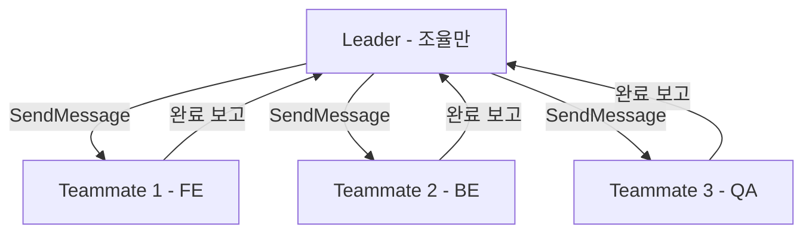
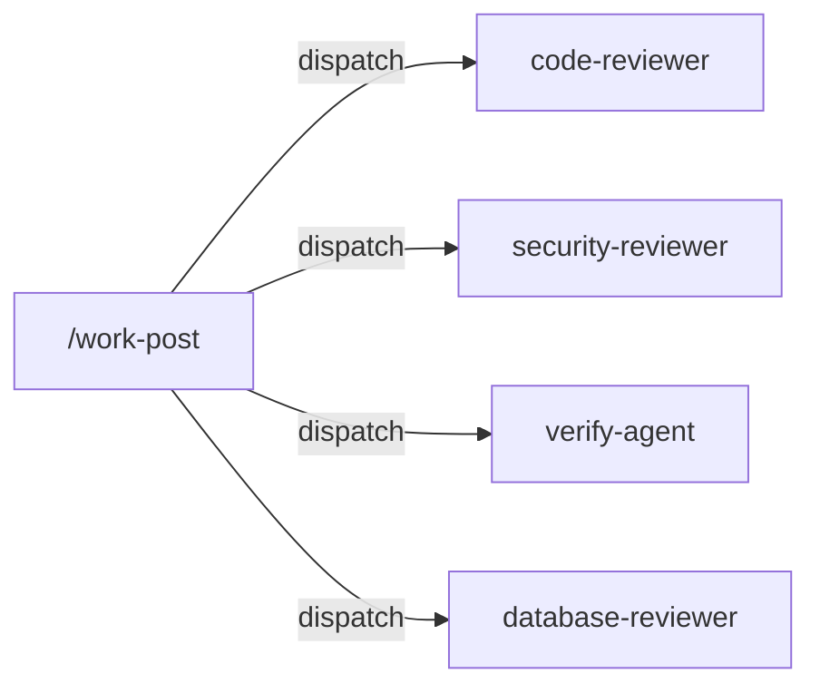
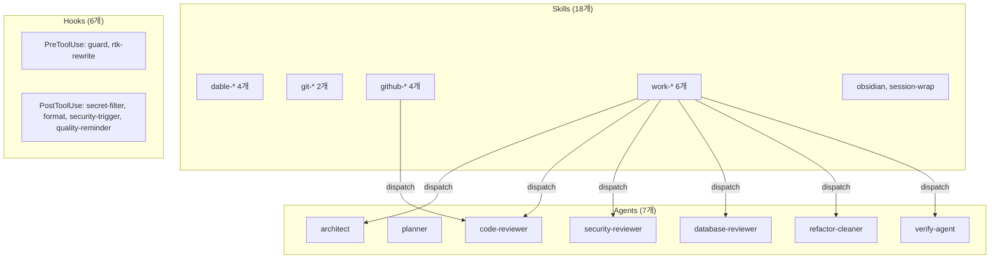

# Claude Code 커스터마이징 가이드 — Implementation Plan

> **For agentic workers:** REQUIRED: Use superpowers:subagent-driven-development (if subagents available) or superpowers:executing-plans to implement this plan. Steps use checkbox (`- [ ]`) syntax for tracking.

**Goal:** 팀원들에게 Claude Code `.claude/` 커스터마이징을 소개하고, 팀 공통 Agents/Skills 적용을 제안하는 Markdown 문서를 작성한다.

**Architecture:** 단일 Markdown 문서(`docs/claude-code-team-guide.md`)로 작성. 5개 섹션(개요, 설정 가이드, 내 설정 소개, 팀 제안, 시현 가이드)으로 구성. 섹션별 독립 작성 후 통합.

**Tech Stack:** Markdown, Mermaid (다이어그램)

**Spec:** `docs/superpowers/specs/2026-03-11-claude-code-team-guide-design.md`

**Source files (참조):**

| 파일                               | 용도                                    |
| ---------------------------------- | --------------------------------------- |
| `claude/.claude/settings.json`     | settings.json 예시, hooks 설정 구조     |
| `claude/.claude/agents/*.md`       | Agent frontmatter 구조, 7개 agent 설명  |
| `claude/.claude/skills/*/SKILL.md` | Skill frontmatter 구조, 18개 skill 설명 |
| `claude/.claude/hooks/*.sh`        | Hook 예시                               |
| `claude/.claude/CLAUDE.md`         | 글로벌 규칙 예시                        |
| `claude/.claude/rules/*.md`        | Rules 구조 참조                         |

---

## Chunk 1: 문서 뼈대 + 섹션 1-2

### Task 1: 문서 뼈대 생성

**Files:**

- Create: `docs/claude-code-team-guide.md`

- [ ] **Step 1: 빈 문서에 전체 섹션 헤딩 작성**

```markdown
# Claude Code 커스터마이징 가이드

> 개인 `.claude/` 설정을 공유하고, 팀 공통으로 적용할 Agents/Skills를 제안합니다.

## 목차

1. [개요](#1-개요)
2. [설정 구조 가이드](#2-설정-구조-가이드)
3. [내 설정 소개](#3-내-설정-소개)
4. [팀 적용 제안](#4-팀-적용-제안)
5. [시현 시나리오 가이드](#5-시현-시나리오-가이드)

---

## 1. 개요

(Task 2에서 작성)

## 2. 설정 구조 가이드

(Task 3-6에서 작성)

## 3. 내 설정 소개

(Task 7에서 작성)

## 4. 팀 적용 제안

(Task 8에서 작성)

## 5. 시현 시나리오 가이드

(Task 9에서 작성)
```

- [ ] **Step 2: 파일 생성 확인**

Run: `head -20 docs/claude-code-team-guide.md`

---

### Task 2: 섹션 1 — 개요

**Files:**

- Modify: `docs/claude-code-team-guide.md`

- [ ] **Step 1: 개요 섹션 작성**

`## 1. 개요` 자리에 다음 내용을 채운다:

- 문서의 목적: 개인 설정 소개 + 팀 공통 적용 제안
- 대상 독자: CLAUDE.md, settings.json 설정 경험이 있는 사용자
- 문서 구조 안내: 섹션 1-3은 [가이드], 섹션 4는 [제안], 섹션 5는 [가이드+제안]
- 분량: 10-15줄

---

### Task 3: 섹션 2.1 — .claude/ 디렉토리 구조 + settings.json

**Files:**

- Modify: `docs/claude-code-team-guide.md`
- Read: `claude/.claude/settings.json`

- [ ] **Step 1: settings.json을 읽고 주요 필드 파악**

`settings.json`에서 다음 필드의 실제 구조를 확인:

- `permissions` (allow/deny)
- `env` (환경변수)
- `hooks` (PreToolUse/PostToolUse)
- `enabledPlugins`

- [ ] **Step 2: 섹션 2.1 작성**

포함할 내용:

1. `.claude/` 디렉토리 트리 (실제 구조 기반)

```
.claude/
├── CLAUDE.md          # 행동 규칙 + 프로젝트 지침
├── settings.json      # 핵심 설정 파일
├── agents/            # Sub-agent 정의
├── skills/            # Workflow 레시피
├── hooks/             # 자동 실행 스크립트
└── rules/             # 코딩 컨벤션
```

2. settings.json 주요 필드 설명 + 축약 예시

```json
{
  "permissions": {
    "allow": ["Bash(*)", "Read(*)", ...],
    "deny": ["Bash(*rm -rf*)", ...]
  },
  "env": {
    "CLAUDE_CODE_EXPERIMENTAL_AGENT_TEAMS": "1"
  },
  "hooks": { ... },
  "enabledPlugins": [...]
}
```

3. 글로벌(`~/.claude/`) vs 프로젝트(`.claude/`) 설정 우선순위 설명
   - 프로젝트 설정이 글로벌을 override
   - CLAUDE.md는 병합됨 (글로벌 + 프로젝트)

---

### Task 4: 섹션 2.2 — 실행 체계 (Agents, Agent Teams, Skills, 관계)

**Files:**

- Modify: `docs/claude-code-team-guide.md`
- Read: `claude/.claude/agents/code-reviewer.md` (frontmatter 예시)
- Read: `claude/.claude/skills/git-commit/SKILL.md` (frontmatter 예시)
- Read: `claude/.claude/skills/work-post/SKILL.md` (Skill→Agent 관계 예시)
- Read: `claude/.claude/skills/work/SKILL.md` (Agent Teams 예시)

- [ ] **Step 1: Agent frontmatter 구조 확인**

`agents/code-reviewer.md`에서 frontmatter 필드를 확인:

- `name`, `description`, `tools`, `model`

- [ ] **Step 2: Skill frontmatter 구조 확인**

`skills/git-commit/SKILL.md`에서 frontmatter 필드를 확인:

- `name`, `model`, `allowed-tools`, `description`
- auto-trigger vs `disable-model-invocation: true` 차이

- [ ] **Step 3: Agent Teams 구조 확인**

`skills/work/SKILL.md`에서 확인:

- Leader-Teammate 구조 (Step 2, 6)
- 파일 소유권 분리 규칙 (Step 3)
- 역할 템플릿 (풀스택, 리팩토링, 버그 조사)
- 전제조건: `CLAUDE_CODE_EXPERIMENTAL_AGENT_TEAMS: "1"`

- [ ] **Step 4: Skill→Agent 호출 패턴 확인**

`skills/work-post/SKILL.md`에서 Agent dispatch 코드 블록 확인

- [ ] **Step 5: 섹션 2.2 작성**

4개 하위 섹션 작성:

**Agents:**

- 개념 설명 (1-2문단)
- frontmatter 작성법 예시 (code-reviewer.md 기반)
- 호출 방식: `Agent tool의 subagent_type` 파라미터

**Agent Teams:**

- 전제조건: `CLAUDE_CODE_EXPERIMENTAL_AGENT_TEAMS: "1"`
- Leader-Teammate 구조 다이어그램 (Mermaid)



- 파일 소유권 분리 원칙
- 역할 템플릿 표 (풀스택, 리팩토링, 버그 조사)

**Skills:**

- 개념 설명 (1-2문단)
- frontmatter 작성법 예시 (git-commit 기반)
- auto-trigger vs 명시적 호출 차이 설명

**Skill ↔ Agent 관계:**

- 역할 구분: Skill = 오케스트레이터, Agent = 전문 실행자
- 예시 다이어그램 (Mermaid): work-post가 4개 agent를 병렬 dispatch



- Agent 재사용: code-reviewer가 work-post에서도, github-pr-review에서도 호출됨

---

### Task 5: 섹션 2.3 — Hooks

**Files:**

- Modify: `docs/claude-code-team-guide.md`
- Read: `claude/.claude/settings.json` (hooks 섹션)
- Read: `claude/.claude/hooks/format-file.sh` (간단한 예시)

- [ ] **Step 1: hooks 설정 구조 확인**

`settings.json`의 `hooks` 필드에서 PreToolUse/PostToolUse 구조, matcher 패턴 확인

- [ ] **Step 2: 섹션 2.3 작성**

포함할 내용:

1. 개념: tool 실행 전후에 자동으로 실행되는 shell script
2. 종류 표:

| 종류        | 시점         | 가능한 동작        | 예시           |
| ----------- | ------------ | ------------------ | -------------- |
| PreToolUse  | tool 실행 전 | 차단(exit 2), 수정 | 위험 명령 차단 |
| PostToolUse | tool 실행 후 | 출력 처리, 알림    | 파일 포맷팅    |

3. settings.json 설정 예시:

```json
"hooks": {
  "PreToolUse": [{
    "matcher": "Bash",
    "hooks": [{
      "type": "command",
      "command": "~/.claude/hooks/remote-command-guard.sh",
      "timeout": 5000
    }]
  }]
}
```

4. hook 스크립트 작성 요령:
   - stdin으로 JSON 입력 받음
   - exit code: 0 = 허용, 2 = 차단
   - matcher 패턴: tool 이름 또는 `Edit|Write` 같은 OR 패턴

---

## Chunk 2: 섹션 3-5 + 최종 통합

### Task 6: 섹션 3 — 내 설정 소개

**Files:**

- Modify: `docs/claude-code-team-guide.md`
- Read: `claude/.claude/skills/obsidian/SKILL.md` (개인용 skill 설명)
- Read: `claude/.claude/skills/session-wrap/SKILL.md` (개인용 skill 설명)

- [ ] **Step 1: 전체 구성 다이어그램 작성**

전체 구성을 한눈에 보여주는 Mermaid 다이어그램:



- [ ] **Step 2: 설계 철학 작성**

3가지 핵심 원칙:

- 다층 안전장치: hooks(자동 가드) → agents(전문 검증) → skills(워크플로우)
- 병렬 실행: Agent Teams + Skill의 병렬 dispatch
- 토큰 효율: RTK proxy

- [ ] **Step 3: 개인용 하이라이트 작성**

- `obsidian`: 용도 1-2줄
- `session-wrap`: 4개 subagent 설명 + 용도

---

### Task 7: 섹션 4 — 팀 적용 제안

**Files:**

- Modify: `docs/claude-code-team-guide.md`
- Read: `claude/.claude/agents/*.md` (7개 agent의 description 확인)
- Read: `claude/.claude/skills/*/SKILL.md` (16개 skill의 description 확인)

- [ ] **Step 1: 추천 Agents 표 작성**

7개 agent를 표로 정리. 각 agent에 대해:

- 역할 (1줄)
- 어떤 skill에서 호출되는지
- 왜 팀에 유용한지 (1줄)

실제 agent 파일의 `description` 필드를 참조하여 정확히 기술.

- [ ] **Step 2: 추천 Skills 표 작성**

4개 그룹(`dable-*`, `git-*`, `github-*`, `work-*`)으로 구분하여 작성.
각 skill에 대해:

- 용도 (1줄)
- 호출 방식 (`/skill-name`)
- 사용 시나리오 (1줄)

실제 skill 파일의 `description`과 `argument-hint`를 참조.

- [ ] **Step 3: 프로젝트 repo 적용 방법 작성**

step-by-step 가이드:

1. 프로젝트 루트에 `.claude/` 디렉토리 생성
2. agents/, skills/ 복사 (어떤 파일을 어디에)
3. settings.json 프로젝트별 override 방법
4. `.gitignore` 패턴 예시
5. hooks 경로 주의사항 (절대경로 → `~` 통일)

- [ ] **Step 4: 논의 포인트 작성**

- Rules: code-principles.md와 언어별 conventions를 팀 표준으로 쓸지
- Hooks: format-file, remote-command-guard를 팀 공통으로 적용할지
- 각 항목에 "논의 질문" 형태로 제시

---

### Task 8: 섹션 5 — 시현 시나리오 가이드

**Files:**

- Modify: `docs/claude-code-team-guide.md`

- [ ] **Step 1: 시나리오 A 작성 — 기능 구현 full cycle**

포함할 내용:

- 흐름도 (텍스트 또는 Mermaid)
- 각 단계별 설명 (어떤 skill이 무엇을 하는지)
- 사전 준비물 체크리스트
- 보여줄 포인트 (팀원들에게 인상적인 부분)
- 예상 소요 시간

- [ ] **Step 2: 시나리오 B 작성 — PR 리뷰 cycle**

포함할 내용:

- 흐름도
- 5개 관점 병렬 리뷰 설명
- 리뷰 코멘트 반영 흐름
- 사전 준비물 (리뷰할 PR)
- 보여줄 포인트

---

### Task 9: 최종 통합 + 리뷰

**Files:**

- Modify: `docs/claude-code-team-guide.md`

- [ ] **Step 1: 전체 문서 통읽기 리뷰**

확인 사항:

- 섹션 간 흐름이 자연스러운지
- 중복 내용이 없는지
- 수치 일관성 (agent 7개, skill 18개 중 팀 추천 16개 + 개인용 2개, hook 6개)
- [가이드] / [제안] 구분이 명확한지
- Mermaid 다이어그램 문법 오류

- [ ] **Step 2: 목차 링크 확인**

목차의 앵커 링크가 실제 헤딩과 일치하는지 확인

- [ ] **Step 3: 최종 확인 후 사용자에게 리뷰 요청**

문서를 사용자에게 보여주고 피드백 수렴
